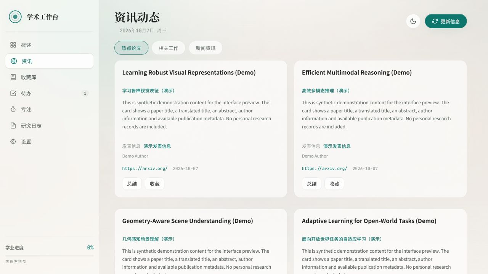
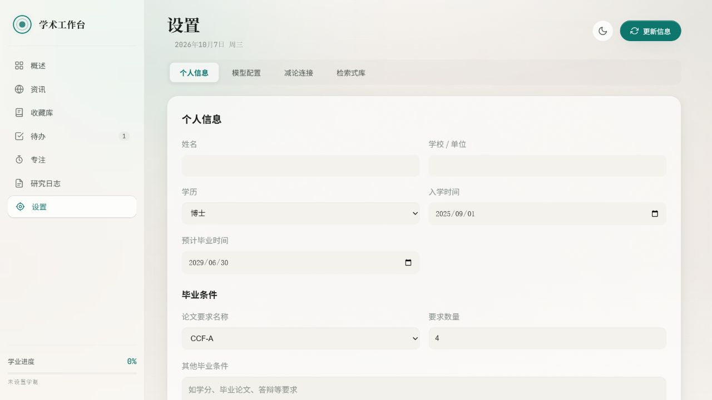

<div align="center">

# Academic Workbench

A local workspace for paper discovery, AI news, literature collections, and research progress.

**Python 3.12 · Vanilla HTML / CSS / JavaScript · Local storage · MIT License**

</div>

Built on [wujing855/academic-workbench](https://github.com/wujing855/academic-workbench), with a redesigned navigation structure and a focus on paper discovery and research management. See [Acknowledgments](#acknowledgments) for attribution.

## Preview





Screenshots use synthetic demo data. The current application interface is in Chinese.

## Features

| Page | What it does |
| --- | --- |
| Overview | Academic timeline, publication requirements, registered papers, total publication count, and discovery statistics |
| Information | Trending Papers, Related Work, and AI News |
| Collections | Paper library and saved news, search, summaries, and collection management |
| Tasks | Manage research tasks |
| Focus | Focus timer |
| Research Journal | Record research notes and ideas |
| Settings | Personal profile, model configuration, Reduct connection, and search queries |

### Paper discovery and AI news

- **Trending Papers:** discover candidates from Hugging Face Daily Papers and Reduct, enrich their metadata through arXiv, and deduplicate entries. Include papers published on arXiv within the last seven calendar days.
- **Related Work:** use saved arXiv search queries to retrieve matching submissions from the last seven calendar days. Pagination retrieves all matching results within this period.
- **AI News:** read AI Hot RSS and retain entries dated within the last seven calendar days. Available history and article length depend on the feed.
- **Unified updates:** update all sources manually with the Update Information button, or automatically at **10:00 and 16:00, Asia/Shanghai**, while the service is running.
- **Cache reuse:** reuse available metadata and title translations. Reloading the page reads cached data rather than starting a full update.

Paper cards display the original title, a Chinese title translation when available, abstract, authors, publication metadata, and arXiv link. Initial retrieval and translation can take longer than subsequent updates.

### Collections and search queries

Search the paper library by title, abstract, author, or tag. Import papers using an arXiv identifier or URL. Search saved news by title or article text, generate summaries, or remove saved items.

Create, edit, copy, and delete arXiv search queries. You can also provide a public GitHub paper-list repository URL: the application reads its README, uses the configured summary model to identify topics, and drafts a query. The generated query can be reviewed and edited before saving. Public repositories with Markdown paper lists are supported.

### Academic progress

Configure your degree, enrollment date, expected graduation date, and publication requirement. Optional name and institution fields personalize the sidebar.

Register publications with separate CCF and SCI classifications. Graduation progress uses an exact match against the selected classification. The total publication count includes all registered papers. Unspecified classifications are hidden on cards; additional graduation conditions are saved as notes.

## Quick start

Recommended environment: **Python 3.12**. The code requires Python 3.10 or newer. The backend uses the standard library, supplemented by time-zone data and a portable HTTPS certificate bundle.

Clone the repository:

```bash
git clone https://github.com/XiantaoHu/academic-workbench.git
cd academic-workbench
```

### Linux, macOS, or WSL

```bash
python3 -m venv .venv
source .venv/bin/activate
python -m pip install -r requirements.txt
python server.py
```

### Windows

```powershell
py -3.12 -m venv .venv
.\.venv\Scripts\python.exe -m pip install -r requirements.txt
.\.venv\Scripts\python.exe server.py
```

Open [http://127.0.0.1:8765](http://127.0.0.1:8765), configure the application in Settings, and start an information update.

Tasks, the focus timer, research notes, and local collection management do not require an API key. Translation, AI summaries, and GitHub query generation require a compatible model service.

### Docker

```bash
docker compose up -d --build
```

The container uses Python 3.12. Compose binds the port to localhost and stores data in local `data/` and `data_snapshots/` directories.

The standalone server listens on `0.0.0.0:8765` and has no account authentication. Restrict access to a trusted local environment; do not expose it directly to the internet. Scheduled updates require a running service and will not run while the computer is shut down or asleep.

## Configuration

### AI models

In **Settings → Model Configuration**, enter an OpenAI-compatible API base URL and API key. Refresh the available model list, select the title-translation and summary models, and save.

Model discovery requires the provider to support `/models`. Model availability, billing, and rate limits depend on the provider.

For file-based configuration, copy `data/llm_config.example.json` to `data/llm_config.json` and fill in your own values. Never commit the real configuration.

### Reduct authorization

In **Settings → Reduct Connection**, open Reduct and sign in:

1. Open browser developer tools with F12 and select **Network**.
2. Reload the trending page and filter requests by `hot_list`.
3. Select the **GET** request, not the **OPTIONS** preflight request.
4. Under **Headers → Request Headers**, copy the value of `Authorization`.
5. Paste it into the application and save. Preserve a `Bearer` prefix if present.

Use only the header value. No account password is required. Renew the authorization value when it expires. Integration depends on the current Reduct interface and your account permissions.

### News feed

The default public feed is `https://aihot.news/feed.xml`.

To use another subscription URL, copy `data/news_config.example.json` to `data/news_config.json`, set `aihot_feed_url`, restart the service, and update information:

```json
{
  "aihot_feed_url": "https://aihot.news/feed.xml"
}
```

Personal subscription URLs may contain account identifiers. Keep them in the local configuration only. The application applies its seven-day filter, but cannot recover historical entries that the feed does not provide.

## Data and privacy

- Configuration, tasks, notes, collections, publication records, and caches are stored locally in `data/`; snapshots are stored in `data_snapshots/`.
- Local storage does not mean offline operation. Updates contact external sources, and AI features send the relevant text to your configured model provider.
- Credentials are masked in the interface but stored in local JSON files, not an encrypted credential vault.
- Runtime data and real configuration files are excluded by `.gitignore`. Public configuration templates contain no working credentials.

Back up `data/` and `data_snapshots/` before upgrades, and preserve them when replacing application code.

## Project structure

```text
academic-workbench/
├── server.py                HTTP service and update scheduling
├── fetchers.py              RSS/arXiv retrieval and title translation
├── trending_papers.py       Trending candidates and metadata caching
├── publication_lookup.py    Publication metadata enrichment
├── information_counts.py    Counts and new-item statistics
├── workbench_settings.py    Configuration and local storage
├── web/                     Frontend and visual assets
├── data/*.example.json      Public configuration templates
├── docs/screenshots/        Demo interface screenshots
├── requirements.txt         Environment dependencies
├── Dockerfile               Optional container environment
├── compose.yaml             Local container deployment
├── pdf_worker/              Optional PDF worker inherited from upstream
└── LICENSE                  MIT license and upstream attribution
```

Optional PDF engines require separate dependencies.

## Troubleshooting

**Missing translated titles:** check the translation model and API credentials. Failed translations leave the original title visible; later updates can fill missing translations.

**Unchanged item counts:** duplicate papers are merged, and expired entries leave the seven-day window. An update may complete without increasing the total.

**GitHub query generation fails:** verify that the repository is public and contains a README. Check network access and summary-model configuration. Errors distinguish retrieval failures, rate limits, and model failures.

**Automatic updates do not run:** keep the service running. Configure an operating-system service manager if you need persistent operation.

## Acknowledgments

Thank you to [wujing855/academic-workbench](https://github.com/wujing855/academic-workbench) and its contributors for the original project on which this work is based.

## License

Released under the [MIT License](LICENSE), with the original copyright notice preserved. Third-party content remains subject to its respective licenses and terms.
